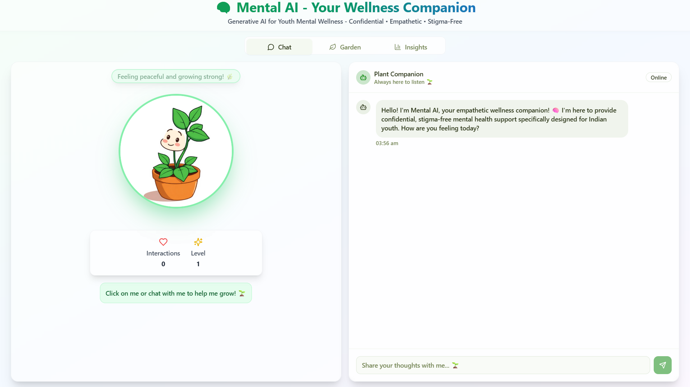
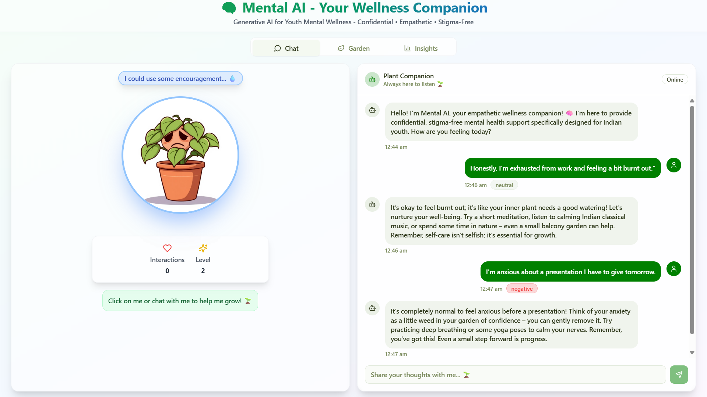
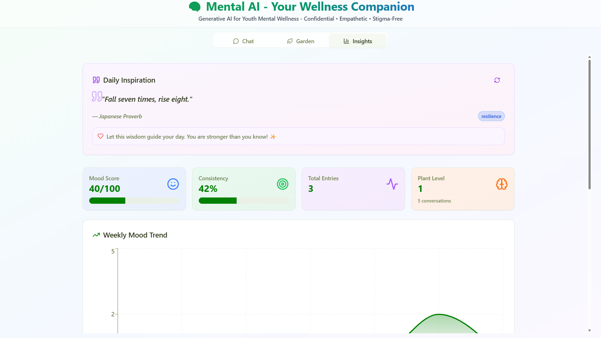

# 🧠 Mental AI — Generative AI for Youth Mental Wellness

<div align="center">

[](https://github.com/Anshulmehra001/Mental-AI-Generative-AI-for-Youth-Mental-Wellness)
[](https://ai.google.dev)
[](LICENSE)

**An AI-powered mental wellness companion designed for Indian youth, breaking the stigma around mental health through innovative, empathetic technology.**

[🚀 View the Live Demo](YOUR_LIVE_DEMO_URL) • [📹 Watch the Video](YOUR_VIDEO_URL)

[📦 Repository](https://github.com/Anshulmehra001/Mental-AI-Generative-AI-for-Youth-Mental-Wellness)

</div>

---

## 🌟 The Problem & Our Solution

In India, millions of young people face immense pressure, but a deep-rooted cultural stigma prevents them from seeking mental health support.

**Mental AI** solves this by providing a confidential, AI-powered companion that transforms the wellness journey into a positive and engaging experience. We eliminate the stigma by visualizing the user's emotional growth as a beautiful, thriving digital plant.

---

## ✨ Core Features

Our goal is to create a complete wellness ecosystem that is both supportive and empowering.

<!-- A horizontal strip of key screenshots: UI, Chat, Analytics -->
<p align="center">
    
    
    
  
</p>

| Feature | Description |
| :--- | :--- |
| 🤖 **Empathetic AI Companion** | Have confidential, supportive conversations powered by **Google Gemini**. The AI understands sentiment and provides culturally-aware responses. |
| 🌱 **Revolutionary Plant Metaphor** | Your emotional journey is visualized as a growing plant. This **breakthrough innovation** removes the clinical feel of therapy and makes self-care rewarding. |
| 📊 **Personal Analytics** | Track your mood over time, identify personal triggers, and gain insights into your well-being through a comprehensive analytics dashboard. |
| 🏆 **Gamified Achievements** | Stay motivated by unlocking achievements and celebrating your wellness milestones. This system helps build positive, long-term habits. |
| 🆘 **Automated Safety Net** | Our system is trained to detect language indicating a crisis and immediately provides direct access to trusted, localized Indian helplines. |

---

## 🛠️ Technology Stack

Mental AI is built on a modern, scalable, and secure architecture to ensure a reliable and private experience.

| Layer | Technology | Purpose |
| :--- | :--- | :--- |
| **AI Engine** | Google Gemini API | Advanced conversational AI & sentiment analysis |
| **Frontend** | React 18 + TypeScript | A dynamic, type-safe, and modern user interface |
| **Styling** | Tailwind CSS + Shadcn/ui | For responsive, accessible, and beautiful design |
| **Database** | Supabase (PostgreSQL) | Secure, scalable data storage with Row Level Security |
| **Build Tool**| Vite | For a lightning-fast development experience |

---

## 🚀 Getting Started (For Judges & Developers)

We've made it as simple as possible to run our prototype.

### Prerequisites
- Node.js (v18+)
- An API key from [Google AI Studio](https://makersuite.google.com/app/apikey)

### Quick Installation
1.  **Clone the repository:**
    ```bash
    git clone https://github.com/Anshulmehra001/Mental-AI-Generative-AI-for-Youth-Mental-Wellness.git
    cd Mental-AI-Generative-AI-for-Youth-Mental-Wellness
    ```
2.  **Install dependencies:**
    ```bash
    npm install
    ```
3.  **Set up environment variables:**
    ```bash
    cp .env.example .env.local
    ```
    Now, add your `VITE_GEMINI_API_KEY` to the newly created `.env.local` file.
    *(Supabase is optional; the app gracefully falls back to local storage.)*

4.  **Run the development server:**
    ```bash
    npm run dev
    ```
The application will now be running on your local machine.

---

## 👨‍💻 About the Team

**Team Data Dynasty** is a passionate group of developers dedicated to creating meaningful social impact through innovative technology.

*   **Aniket Mehra** (Team Leader)
*   **Apoorv Bhargava**
*   **Yishu Bhaskar**

---

<p align="center">
*Proudly built for the Google Cloud Gen AI Exchange Hackathon.*
</p>